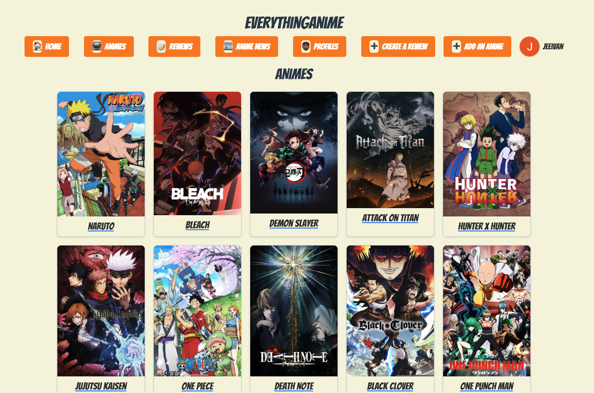
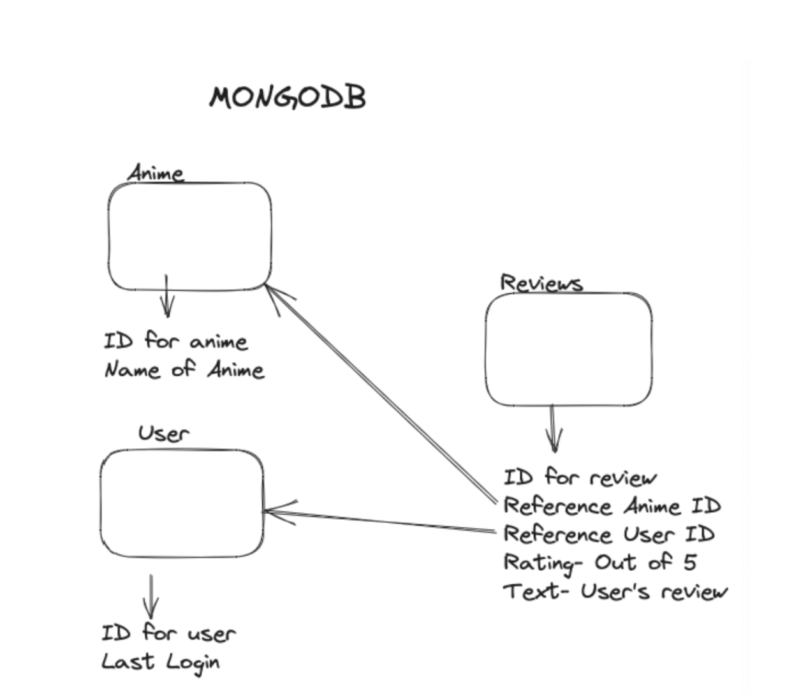
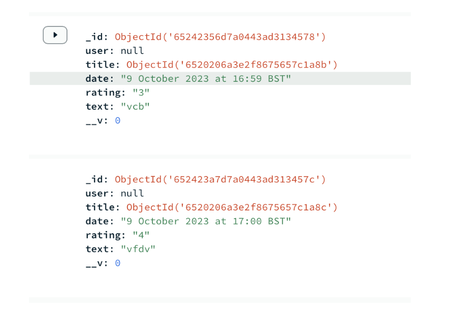
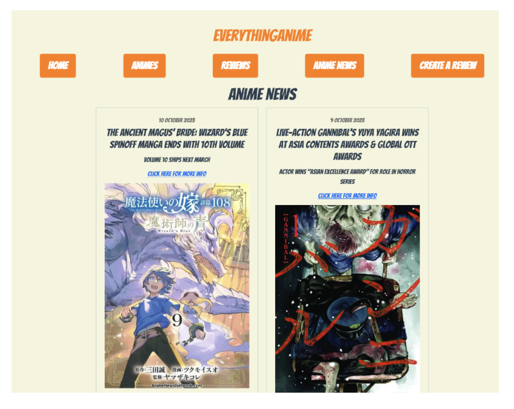
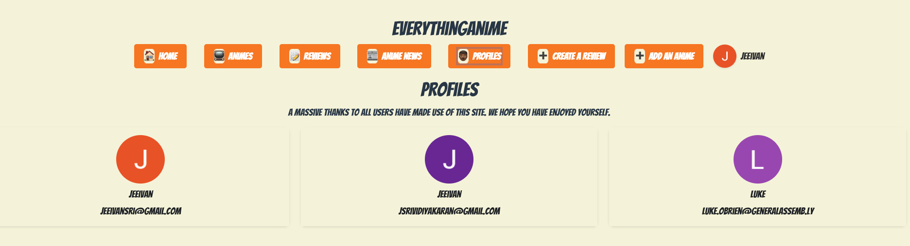

# SEI Unit 2 Project ReadMe



## Project Description

About halfway through the General Assembly Software Engineering Immersive course, we embarked on our second project. After two weeks of gaining experience with Node.js, Express, MongoDB, and Vue.js, we were now tasked with the challenge of applying our newfound knowledge to create our own website. I decided to focus on the topic of anime, as it's a subject I have a deep passion for. My primary goal was to develop a platform where anime enthusiasts could discover their favourite shows and share their own reviews, while also exploring the opinions of fellow fans.

## Table of Contents

- [Deployment Link](#deployment-link)
- [Technologies Used](#technologies-used)
- [Brief](#brief)
- [Planning](#planning)
- [Build Process](#build-process)
- [Challenges](#challenges)
- [Wins](#wins)
- [Key Learnings/Takeaways](#key-learningstakeaways)
- [Future Improvements](#future-improvements)

## Deployment Link

([https://jeeivan.github.io/Space-Invaders-Project/](https://everythinganime.netlify.app/))

## I was given a full week to work on this project and I worked independently to do this with the help of our instructors if I was facing any difficulties. 

## Technologies Used

CSS
HTML
Vanilla Javascript ES6
MongoDB
Mongoose
Node.js
Vue.js
Express


## Brief

Project Objective:
Build a full-stack application using Node/Express/MongoDB.
Gain independence in designing and coding the app.
Exercise creativity by choosing a project aligned with technical requirements.

Technical Requirements:
Include at least 2 data entities, incorporating One:Many or Many:Many relationships.
Implement OAuth authentication and basic authorization for user access.
Integrate full-CRUD data operations within the app's features.
Design a polished user interface consistent with daily-use apps.
Deploy the app online using Netlify.


## Planning

**Home Page/Landing Page:**
Title of EverythingAnime
Have Links for- List of Animes, All reviews, Add review
Be able to edit and delete reviews 
Have google login within this


**List of Animes-** 
Show a list of all anime
Each title will have its own link that will take the user to an individual anime page

**All reviews-**
Show all reviews for all animes
Have each review show the user that made the review, the name of the anime, the star rating, the review and the date it was made

**Individual anime page-**
This will include a picture of the anime, the name of the anime and underneath will include all reviews for that anime
There will also be a link within this page to also take you to the add review page

**Add Review page-**
This will have a form where users have to pick which anime they would like to leave a review for
They can give it a star rating of 0/5
Using expression/pattern so that users can only put in a number from 0-5 and they can only put in anime that is listed within the site
They can then have a section to add their personalised review

**MongoDB-**
Have one collection for user- have their name and last login
Have one collection for anime titles
Have one collection for reviews which will reference that anime



**Vue Files-**
Landing Page

All Animes- Show all animes

Anime- Show single page for anime- e.g. anime/‘individual id for that anime’
Have all reviews for each anime in this
Be able to delete a review in this
Have router link to take you to edit review page

Reviews- Show all reviews

AddReview- Form to add review

EditReview- Be able to edit your review

Nav- This will add in all buttons for different pages with their router links- I will then import this into my app.vue where the nav will be on every page

**Stretch Goals-**
Within all reviews page, being able to filter through reviews that each have a star rating e.g. if you click 5 you can see all 5/5 reviews, and if you press 1 you can see all 1/5 reviews 
Add in some sort of  external API
Make NAV bar look nicer
Have Reviews show user name and their google login logo
Have user schema have given name and logo and have this called 
Create own anime 

## Build Process

**Day 1**

In the development journey of this project, I successfully set up both Express and Vue components, skillfully crafting the basic structure for each page. It was a satisfying process, marking the foundational stages of the project.

Subsequently, I proceeded to define the schemas for both anime and reviews, a meticulous task that laid the groundwork for the app's structure and data organization.

A notable achievement was the seamless referencing of the anime ID within the reviews schema. This integration played a crucial role in establishing a smooth connection between anime pages and their corresponding reviews, significantly improving user navigation.

However, a unique challenge emerged today. I encountered difficulties incorporating the user ID into the review schema. Despite the hurdle, I approached it with determination, recognizing the importance of overcoming this obstacle for the app's overall functionality.



During the development process, I took satisfaction in successfully implementing the star rating feature on my page. This enhancement not only added visual appeal but also made it more user-friendly, allowing users to easily input their ratings.

Furthermore, I'm content with the functionality that allows me to display individual anime pages. By fetching data from MongoDB and utilizing the unique ID of each anime, I've successfully created a distinct page for each anime, enhancing the overall user experience.

**Day 2**

I achieved a significant milestone by getting the edit function to work seamlessly. This accomplishment marked the completion of full CRUD data operations on my website, enabling users to create, update, and delete posts.

I'm particularly pleased with the implementation of an "if" function that restricts editing and deletion privileges to the user who created the review. This ensures that only the original reviewer can modify or delete their content. The mechanism relies on referencing the user's email within each review and comparing it to the email retrieved from the Google login data, providing a secure and personalised experience for users.

```
<div v-if="review.user === userEmail" class="review-actions">
<button @click="deleteReview(review._id)">Delete Review</button>
<router-link :to="`/review/edit/${review._id}`">
<button>Edit Review</button></router-link>
```

As I delved into the styling phase of my website, I found satisfaction in the visual appeal achieved on my anime page. The effort put into refining the aesthetics of that section paid off, creating a visually pleasing and engaging experience for users.

However, a critical self-assessment revealed dissatisfaction with the appearance of my homepage. Recognizing the importance of a captivating and user-friendly entry point, I acknowledged the need for improvement. Enhancing the visual appeal of the homepage became a priority, as I aimed to create a more attractive and welcoming environment for users.

**Day 3**

I'm really pleased with the way I've styled my pages. It was important to me that the individual anime pages are easy for the reader to view, and I feel like I've achieved that goal. As I was working on it, I found joy in the process of making it visually appealing and user-friendly.

I also tackled the challenge of integrating an external API for the anime news page. It took some effort, but I managed to get it working seamlessly. Now, visitors to my website can stay updated with the latest anime news right on the platform. It was a rewarding experience, and I'm proud of the additional functionality it brings.



Working with APIs was a bit intimidating at first, but I'm happy to say that I gained valuable experience through the process. It turned out to be much more manageable than I initially thought, and I can see now how it enhances the overall functionality of my website. Learning and adapting to these new aspects has been a great journey, and I'm content with the progress I've made.

I am pleased with how I was able to link my reviews page to each individual anime page by adding router links, utilising a straightforward approach similar to what I have employed in other pages. This process was facilitated by referencing the unique anime ID within my reviews collection. By establishing a clear connection between the anime ID and the reviews, the website seamlessly navigates users from an anime's main page to its corresponding reviews, enhancing the overall user experience.

```
<h2 class="anime-title">
<router-link :to="'/anime/' + review.title._id">
{{ review.title.name }}</router-link>
```

By adding these links within the reviews page made it easier for the user to interact with the page and means they have to use less clicks instead of going to the anime page and then selecting the specific anime the user would like to see based on the review they saw. I also added in the users email within the reviews so it was clear that different users have left their reviews.

**Day 4**

- I updated my nav bar to show the users profile image and I also added a new page to my nav that allows user to add their own anime
- I found it quite easy to add in the add anime page as I already had a add review page so I was able to use many of the same components front there and change it around so that it adds the information to the anime schema
  
```
app.post("/addAnime", async (req, res) => {
  try {
    const data = req.body;
    // console.log(data);
    const anime = new Anime({
      name: data.name,
      imageURL: data.imageURL,
      description: data.description,
    });
    await anime.save();
    res.sendStatus(200);
  } catch (err) {
    console.log("ERROR MESSAGE HERE ->", err.message);
    res.status(500).json({ error: "Internal Server Error" });
  }
});
```

- I also updated my reviews to have each review show the name of the user who made the review alongside their google profile picture, I did this as I believe it makes it more friendly for the viewer to see all users profile pics and names rather than their email
- To do this I just needed to update my review schemas to get the user name and profile picture from the cookie when they are making the review

```
export default {
  name: "MakeReviewVue",
  data() {
    return {
      error: "",
      review: {
        animeId: "",
        date: "",
        rating: 0,
        text: "",
      },
      animes: [],
      userId: "",
      isInit: false,
      isLoggedIn: false,
      userName: "",
      userEmail: "",
      userImage: "",
    };
  },
  created() {
    this.fetchAnimeTitles();
  },
  mounted() {
    if (this.$cookies.isKey("user_session")) {
      this.isLoggedIn = true;
      const userData = decodeCredential(this.$cookies.get("user_session"));
      this.userName = userData.given_name;
      this.userEmail = userData.email;
      this.userImage = userData.picture;
    }
  }
```

**Day 5**

- On this day I was able to create a new page for profiles which I was pleased with as this allows for all users to see anyone who has logged in to the website
- To add this profile page I needed to add more information into my user schema so that I would be able to access the user’s name and profile picture

```
app.post("/user/login", async (req, res) => {
  console.log(req.body);
  const now = new Date();
  if ((await User.count({ userEmail: req.body.email })) === 0) {
    const newuser = new User({
      userEmail: req.body.email,
      name: req.body.name,
      img: req.body.img,
      lastLogin: now,
    });
    newuser.save().then(() => {
      res.sendStatus(200);
    });
  } else {
    await User.findOneAndUpdate(
      { userEmail: req.body.email },
      { name: req.body.name },
      { img: req.body.img },
      { lastLogin: now }
    );
    res.sendStatus(200);
  }
});
```

- I then used the information from the user collection by using a get in the back end and then fetched the information from the front end to display the profiles on the profiles page
- I am also pleased with how my nav bar looks after I updated the styling for it to add the icons to it, along with the user’s profile picture and name to make the experience more personal to them when they are using the website


## Challenges

I encountered an issue where the create review would appear even though I was logged out but once I refreshed the page it disappeared like it should. To fix this as shown in the code below I used the location.reload() to refresh the page automatically every time the user would log in or out.
After a lot of trouble trying to add the ID of the user I was able to fix this issue by changing it so that the email of the user is referenced instead here rather than ID and this way I could still reference the user through their email as this is still unique to that individual user.

```
  methods: {
    callback: function (response) {
      this.isLoggedIn = true;
      const userData = decodeCredential(response.credential);
      this.userName = userData.given_name;
      this.$cookies.set("user_session", response.credential);
      location.reload();
      fetch(`${process.env.VUE_APP_BACKEND_API}/user/login`, {
        method: "POST",
        headers: {
          "Content-Type": "application/json",
        },
        body: JSON.stringify({
          email: userData.email,
        }),
      }).then(() => {
        console.log("session saved");
      });
    },
    handleLogOut: function () {
      googleLogout();
      this.$cookies.remove("user_session");
      this.isLoggedIn = false;
      location.reload();
    },
  },
};
```

## Wins

- I had a lot of struggle with being able to filter through my reviews but after doing some research into the filter method I was happy I was able to resolve this

```
  methods: {
    filterReviews(rating) {
      rating = parseInt(rating);
      this.filteredReviews = this.reviews.filter(
        (review) => parseInt(review.rating) === rating
      );
    },
  },
```

## Key Learnings/Takeaways

- I have much more confidence in using APIs and incorporating them in my work
- I am confident in being able to use a node.js environment
- I am confident in my skills to use a database and being able to access information from that database to find specific data 
- I am also confident in being able to link databases together by using referencing

## Future Improvements

- To use a wireframe to have a set lay out for my website and be able to add to this to make building the website more efficient
- To use an API for my animes page so that I would not need to add in every anime on the page and the API will be able to fetch a vast amount of animes for the user to see
- Add a search bar within the anime page so if there were a large amount of animes a user would be able to easily access the anime they would like by a search bar rather than scrolling through all the animes on the page


